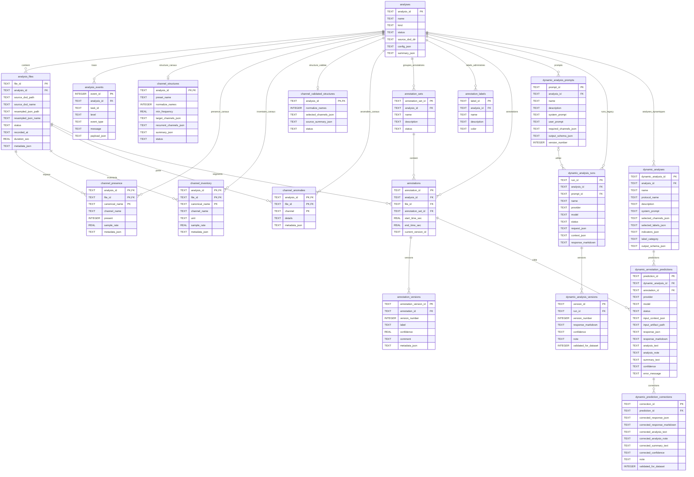
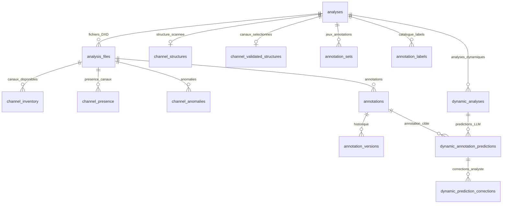
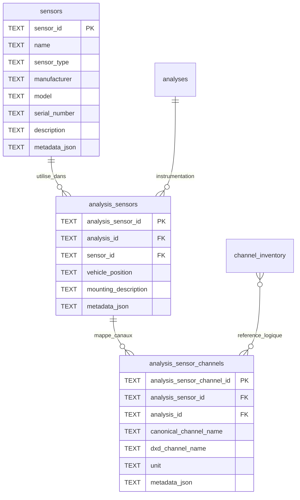

# Schema relationnel app_v2

Ce document represente le schema relationnel actuel de `app_v2`, d'apres
`app_v2/app/db/schema.sql`.

## Vue complete

## Vue metier simplifiee

## Extension future capteurs

